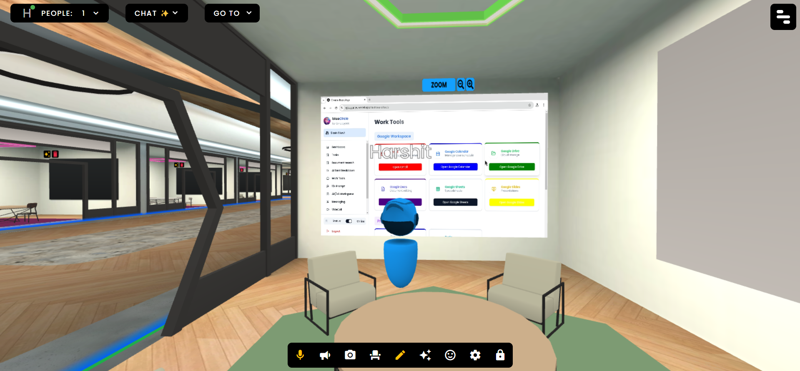
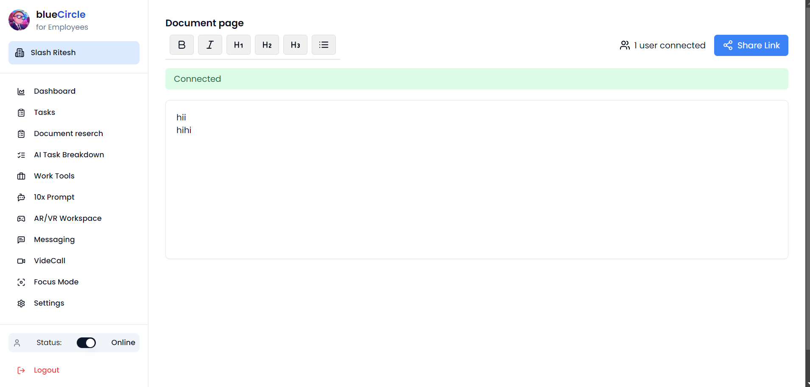
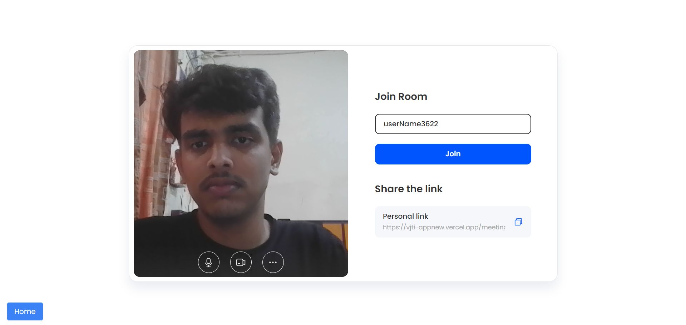
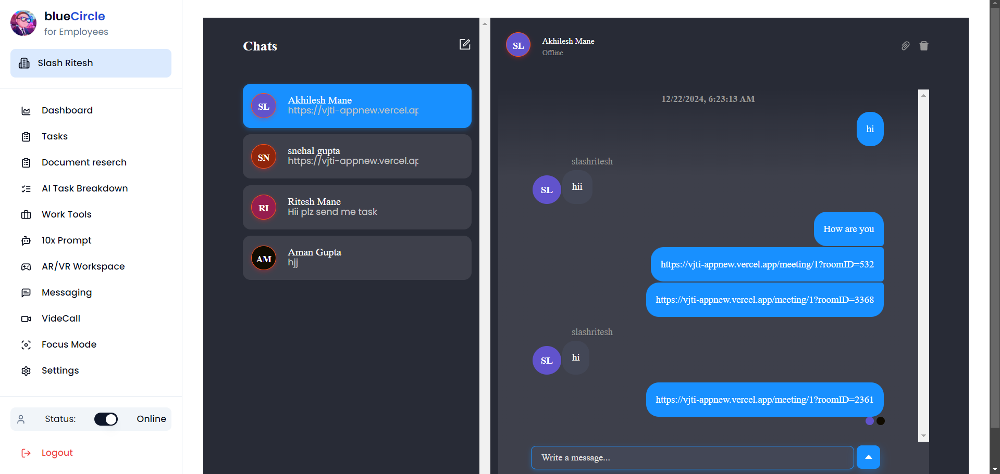
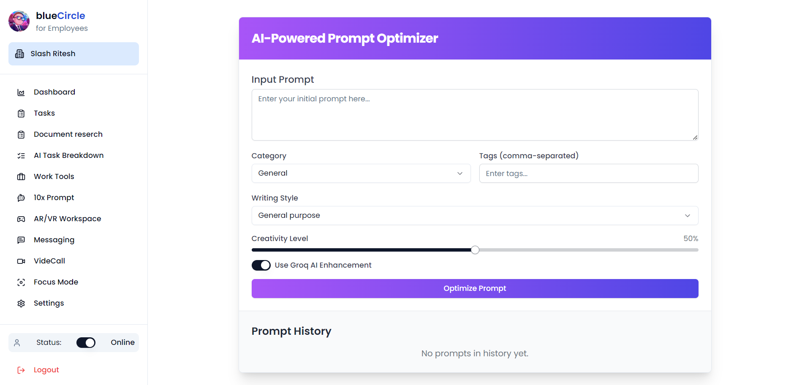
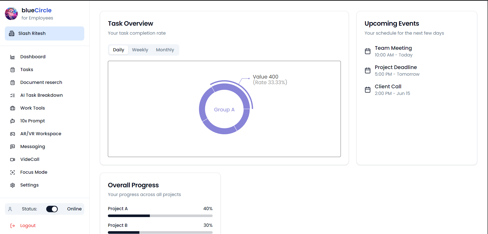

# Cypher Squad

## Virtual VR Collaboration for Remote Workers

### Demo Users:
- **Admin**:  
  - **Email**: amanwebdevv@gmail.com  
  - **Password**: 11223344

- **Employee**:  
  - **Email**: harshitnikam182005@gmail.com  
  - **Password**: 11223344

### Live Preview:  
[Click here to access the live preview of the platform](https://vjti-appnew.vercel.app)

---

### The Problem
Remote workers face several challenges, including:
- **Fragmented Tools**: Businesses use 8-10 tools daily, causing inefficiency (Source: Harvard Business Review).
- **Lack of Productivity**: 59% of employees report losing productive time due to inefficient collaboration tools (Source: McKinsey).
- **Collaboration Issues**: 52% of employees say communication challenges are their biggest productivity obstacle (Source: Slack).
- **Stress and Burnout**: 72% of remote workers experience burnout due to lack of focus and stress management solutions (Source: Gallup).

### Our Solution: Circle.com
Circle.com is a platform that connects organizations with their remote employees in a virtual environment. It offers AI-powered features to boost productivity, such as:
- Content generation
- Automated task scheduling

### Features
- **Integrated Tools**: All necessary tools in one place.
- **AI-Powered Automation**: Enhance efficiency with intelligent automation.
- **Wellness Features**: Stress management and focus improvement.
- **Scalable and Adaptable**: Designed to evolve with business needs.

### Benefits
- **Increased Productivity**: Achieve a 20-30% boost in task management and collaboration efficiency.
- **Reduced Burnout**: Wellness tools reduce employee burnout by 15%.
- **Cost Savings**: Consolidating tools and improving workflows save time and money.
- **Enhanced Employee Satisfaction**: Improved communication and collaboration lead to better engagement.
- **Future-Proofed Operations**: Scalable to meet the evolving needs of businesses.

### Impact
- **Improved Organizational Performance**: Enhanced collaboration and productivity.
- **Employee Well-Being**: Stress management tools promote healthier work-life balance.

### Test User
- **Name**: John Doe
- **Role**: Remote Worker
- **Feedback**: "The platform significantly improved my productivity and reduced stress from managing multiple tools."

### Shaping the Future of Productivity
We are committed to revolutionizing how remote teams work together and ensuring both organizational and employee success.

---
